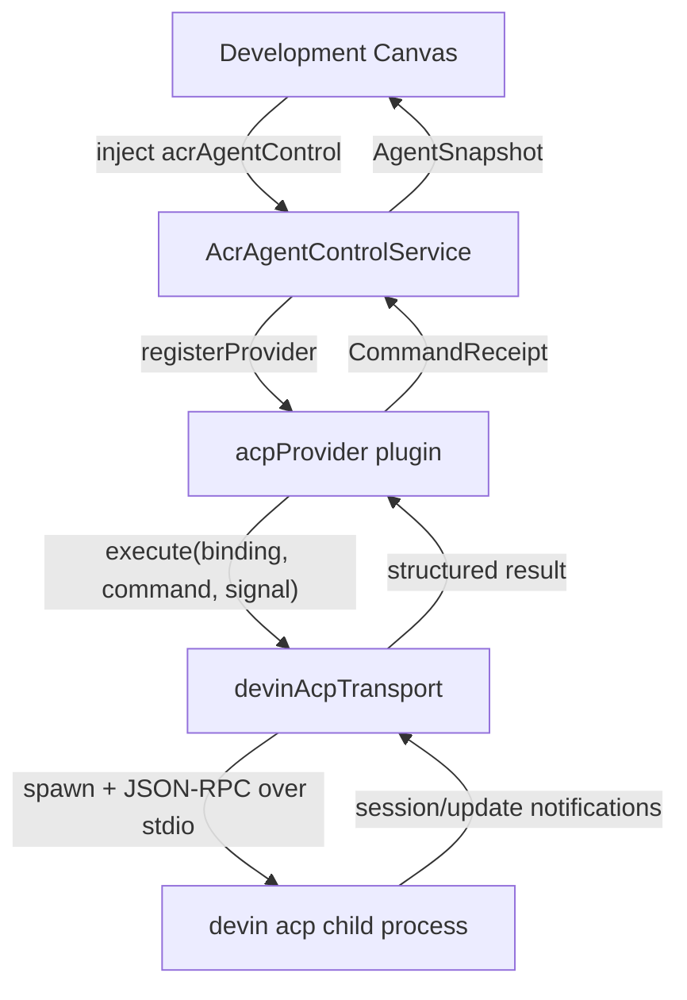

# PRD: Devin ACP Integration

**Feature Branch**: `feature/current/execute-upsert/devin-acp-integration`
**Created**: 2026-08-31
**Status**: In Progress
**Shape**: Ship

## Objective

Wire the `devin acp` subprocess (JSON-RPC over stdio, Agent Client Protocol v1)
as the first concrete `AgentTransport` behind the existing `acpProvider` in
`acryl-control`, so ACRYL Desktop users can drive their Devin subscription
from the Development Canvas using their existing `devin auth login` credentials
or `WINDSURF_API_KEY`.

This is the Phase-8 transport seam the codebase already declares: the
`AgentTransport` interface at `acryl-control/src/agent/agent-control.ts:77-80`
is explicitly commented "vendor SDKs plug in here (Phase 8)" and every provider
currently throws `transport-unavailable`. We fill that seam for the ACP
provider kind, which already has its capability map entry (`'acp'` in
`PROVIDER_CAPABILITIES`) and its factory (`acpProvider(transport?)`).

## Background

### What already exists

- `AcrAgentControl` Cordis service (`acryl-control/src/agent/agent-control.ts`)
  with `registerProvider` / `attach` / `dispatch` / `snapshot`, capability
  gating, runtime/session collision checks, and effect-owned registration.
- `'acp'` provider kind declared in
  `acryl-control/src/agent/providers/capabilities.ts` with `fidelity:
  'structured'` and capabilities: `agent.start`, `agent.stop`, `agent.send`,
  `agent.cancel`, `agent.resume`, `agent.snapshot`, `output.structured`,
  `tool.calls`.
- `acpProvider(transport?)` factory at
  `acryl-control/src/agent/providers/acp.ts` that threads an `AgentTransport`
  through `createProviderPlugin`.
- `createProviderPlugin` factory at
  `acryl-control/src/agent/providers/factory.ts` that registers the provider
  via `ctx.acrAgentControl.registerProvider(ctx, provider)` and throws
  `transport-unavailable` when no transport is wired.
- Design doc `docs/acryl/AGENT_CONTROL_SURFACE_CORDIS_DESIGN.md` lists "ACP
  adapter" as a planned provider type with lifecycle and verification rules.

### What `devin acp` provides

Per the Devin CLI docs (`/usr/local/Caskroom/devin-cli/3000.2.17/share/devin/docs`):

- `devin acp` speaks JSON-RPC over stdio, designed to be spawned as a
  subprocess by an ACP-aware client.
- Credentials come from `devin auth login` (stored credentials) or
  `WINDSURF_API_KEY` env var, or via the ACP `authenticate` request at
  runtime.
- It implements ACP v1: `initialize`, `session/new`, `session/prompt`,
  `session/cancel`, `session/update` notifications, `session/request_permission`,
  and `session/load` (if `loadSession` capability is advertised).

### ACP v1 protocol flow

1. **Initialize**: Client sends `initialize` with protocolVersion, client
   capabilities, clientInfo. Agent responds with protocolVersion, agent
   capabilities, agentInfo, authMethods.
2. **Authenticate** (if needed): Client sends `authenticate` with method +
   credentials. Agent responds with success.
3. **Session Setup**: `session/new` (cwd, mcpServers) → returns sessionId.
   Or `session/load` (sessionId, cwd, mcpServers) → replays history via
   `session/update` then responds.
4. **Prompt Turn**: `session/prompt` (sessionId, prompt ContentBlock[]) →
   Agent sends `session/update` notifications (plan, agent_message_chunk,
   tool_call, tool_call_update, usage_update) → Agent responds with
   `stopReason`. Client may send `session/cancel` notification to abort.
5. **Permission**: Agent sends `session/request_permission` for tool calls →
   Client responds with grant/deny.

## User Scenarios and Testing

### User Story 1 - Use Devin from the Development Canvas (Priority: P0)

As an ACRYL Desktop user with a Devin subscription, I can configure the Devin
ACP provider in settings, authenticate with my `devin auth login` credentials,
and start a Devin agent session from the Development Canvas. The agent
responds to my prompts, reports tool calls, and surfaces structured output
through the existing `fidelity: 'structured'` rendering path.

**Independent test**: Boot `AcrAgentControlService` with the `devinAcpTransport`
wired into `acpProvider`, call `attach` with an ACP request, call `dispatch`
with a `start` command, verify the `devin acp` subprocess spawns and the
initialize handshake completes, call `dispatch` with a `send` command, verify
a prompt round-trip returns a stop reason.

### User Story 2 - Lifecycle correctness (Priority: P0)

When the Devin ACP provider's owning fiber unloads, the `devin acp` subprocess
is killed, stdio streams are drained, and no orphan process remains. A
second activation does not leak a process or collide on the runtime id.

**Independent test**: Boot the service, attach + start, unload the provider
fiber, verify the subprocess PID is no longer alive, re-activate, verify a
new subprocess spawns with a different runtime id.

### User Story 3 - Cancellation works (Priority: P1)

When the Canvas sends a `cancel` command, the transport sends
`session/cancel` to the `devin acp` subprocess, the in-flight prompt turn
stops, and the dispatch resolves with a cancelled stop reason.

**Independent test**: Start a session, send a long prompt, cancel it
mid-flight, verify the dispatch resolves with a cancelled result and no
zombie process.

### User Story 4 - Auth mode configuration (Priority: P1)

A user can select between `devin auth login` credentials (default),
`WINDSURF_API_KEY` env passthrough, or interactive ACP `authenticate` via
Desktop settings. The transport uses the selected mode at subprocess spawn
time.

**Independent test**: Configure each auth mode, verify the subprocess
receives the correct environment / initialize flow.

## Functional Requirements

- **FR-001**: A `devinAcpTransport` MUST implement the `AgentTransport`
  interface (`execute(binding, command, signal)`) from
  `acryl-control/src/agent/agent-control.ts`.
- **FR-002**: The transport MUST spawn `devin acp` as a child process owned
  by one `ctx.effect()` with a disposer that kills the process, drains
  stdio, and clears the JSON-RPC correlation map.
- **FR-003**: The transport MUST translate `AgentCommand` kinds to ACP
  JSON-RPC methods: `start` → `initialize` + `session/new`, `send` →
  `session/prompt`, `cancel` → `session/cancel`, `stop` → process kill,
  `resume` → `session/load` (if supported) or `session/new`.
- **FR-004**: The transport MUST correlate JSON-RPC request/response by id
  and thread `signal.aborted` into a `session/cancel` notification + child
  SIGTERM.
- **FR-005**: The transport MUST surface `session/update` notifications as
  structured `output.structured` / `tool.calls` results that the Canvas
  renders for `fidelity: 'structured'` providers.
- **FR-006**: The transport MUST handle the ACP `authenticate` request by
  forwarding stored `devin auth login` credentials, passing
  `WINDSURF_API_KEY` env, or surfacing the request to the Desktop UI.
- **FR-007**: The transport MUST resolve the `devin` binary via configured
  path, `which devin` fallback, or the Devin Desktop bundled install.
- **FR-008**: A Desktop settings entry MUST expose: binary path, auth mode,
  optional default model, optional permission-mode passthrough.
- **FR-009**: The transport MUST NOT introduce a parallel lifecycle, DI,
  event, or provider framework — it uses Cordis `Service`, `inject`,
  `effect`, and Loader composition only.
- **FR-010**: The transport MUST NOT edit `deepseek-harness/` or add a new
  provider kind — `'acp'` already exists.

## Non-goals

- Building the full ACRYL Registry, Blend, or plugin-ecosystem from spec 021.
- Per-agent permission overrides or the global permission matrix.
- Remote/cloud Devin sessions (only local `devin acp` subprocess).
- A Devin plugin catalog (the `dsh-community-market` `CatalogAdapter` seam is
  a separate concern).
- Knowledge, Playbooks, or Secrets from the Devin account (Devin CLI does
  not yet support these).

## Success Criteria

- `corepack pnpm run verify` passes (typecheck + test).
- A real `devin acp` subprocess (or a stub JSON-RPC server) completes an
  attach → start → send round-trip through `AcrAgentControl`.
- The subprocess is killed on fiber unload with no orphan process.
- A second activation spawns a new subprocess with a different runtime id.
- `capability-rejected` is thrown when the Canvas requests a capability ACP
  doesn't declare.
- No new provider kind, no new framework, no `deepseek-harness/` edits.

## Tech Context (Binding Constraint)

This project uses the following tools. Use them, not alternatives.

- Package manager: pnpm (via Corepack 11.7.0)
- Ad-hoc runner: pnpm dlx
- Build system: tsdown + tsc
- Test runner: vitest
- Node: ^22.19.0 || >=24.0.0
- Linter: ESLint (antfu) if present

System tools run via: corepack pnpm run <script>
Never use: npm, npx, yarn, jest, biome

## Architecture

### Cordis mini-design

1. **Capability and plugin boundary**: The `devinAcpTransport` owns the
   `devin acp` subprocess lifecycle and ACP JSON-RPC protocol translation.
   It is a transport, not a provider — the provider (`acpProvider`) already
   exists. The transport is created by a configuration-bearing factory and
   passed to `acpProvider(transport)`.

2. **Provides and consumes**: The transport provides `AgentTransport.execute`.
   It consumes `child_process.spawn` for the subprocess, `AbortSignal` for
   cancellation, and a configuration object (binary path, auth mode, cwd,
   env, model). It has no hard `inject` requirements — it is a plain object,
   not a Cordis service. The provider plugin that wraps it injects
   `acrAgentControl`.

3. **Effects and disposal**: The subprocess, its stdio streams, and the
   JSON-RPC correlation map are acquired inside the `ctx.effect()` that
   owns the provider registration (via `registerProvider`'s `owner.effect`
   tie). The disposer kills the process (SIGTERM → SIGKILL after 2s),
   drains stdio, and clears the map. Cancellation via `signal.aborted`
   sends `session/cancel` then SIGTERM.

4. **Configuration and composition**: The transport is created from a
   `DevinAcpTransportConfig` (binaryPath?, authMode, cwd, env?, model?,
   permissionMode?). The config is read from Desktop settings at
   composition time and passed to `acpProvider(devinAcpTransport(config))`.
   No Loader row id changes — the provider plugin name is already
   `acryl-agent-acp`.

5. **Events and durability**: ACP `session/update` notifications are
   translated to structured results returned from `execute`. There are no
   Cordis events dispatched — the transport is a synchronous request/response
   adapter. Durable session state (sessionId) lives in the `AgentSnapshot`
   via `providerSessionRef`.

6. **Verification**: Real Loader activation + PENDING/reactivation + provider
   unload + HMR + capability rejection + identity collision tests in
   `acryl-control/tests/devin-acp-transport.spec.ts`. A stub JSON-RPC server
   is used for CI; a real `devin acp` is used for a smoke test gated behind
   `DEVIN_ACP_SMOKE=1`.

### File plan

```
acryl-control/src/agent/transports/
  devin-acp.ts                    # devinAcpTransport(config) → AgentTransport
  devin-acp-config.ts             # DevinAcpTransportConfig type + defaults
  acp-json-rpc.ts                 # JSON-RPC 2.0 over stdio client (reusable)
acryl-control/src/index.ts        # export devinAcpTransport
acryl-control/tests/
  devin-acp-transport.spec.ts     # transport + lifecycle + cancellation tests
  acp-json-rpc.spec.ts            # JSON-RPC client unit tests
acryl-desktop/src/desktop-settings-api.ts  # add DevinAcpSettings type
```

### Mermaid: transport architecture


